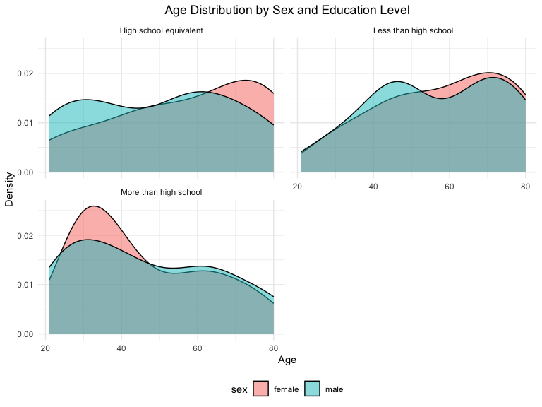

Homework3
================
Yunjia Liu
2024-10-14

## Problem1

Load the dataset.

``` r
data("ny_noaa")
```

Answer to the questions. 1. Data Cleaning and Exploring the Snowfall
Data First, we separate variables for year, month, and day in the
dataset. Besides, noticing the tmax and tmin are chr in the table, we
will convert the temperature into the numeric. Also, according to the
description of the dataset, temperature and precipitation are in tenths
of degrees C and mm separately. So, we also need to convert the unit for
these two variables. The unit of snowfall is already in mm.

``` r
ny_noaa_clean = ny_noaa |>
  separate(date, c('year', 'month', 'day'), sep = "-",remove = FALSE) |>
  mutate(tmax = as.numeric(tmax),
         tmin = as.numeric(tmin),
         tmax = tmax / 10,
         tmin = tmin / 10,
         prcp = prcp / 10,
         month = as.numeric(month),
         year = as.numeric(year))
```

Second, explore the snowfall data. The most common snowfall value is 0
mm, which suggests many observations recorded no snowfall. This could
also indicate periods of no snow or that snowfall isn’t always measured
consistently. The second common value is NA, which suggests the
measurement of snowfall is missing. The third and fourth common is 25
and 13 mm.

``` r
# Snowfall summary
snowfall_counts = ny_noaa_clean |>
  count(snow) |>
  arrange(desc(n))

print(head(snowfall_counts, 10))
```

    ## # A tibble: 10 × 2
    ##     snow       n
    ##    <int>   <int>
    ##  1     0 2008508
    ##  2    NA  381221
    ##  3    25   31022
    ##  4    13   23095
    ##  5    51   18274
    ##  6    76   10173
    ##  7     8    9962
    ##  8     5    9748
    ##  9    38    9197
    ## 10     3    8790

2.  Two-Panel Plot: Average Max Temperature in January and July. We
    first calculate the average max temperature by grouping the date and
    filtering the months from 12 months to Jan and July.

The plot shows the average maximum temperature in January and July
across several weather stations in New York, with trends for each
station shown across the years. These months represent two extreme
seasons: Winter (cold) and Summer (hot). Temperatures in Jan is be much
lower compared to July. All stations in NY seems to have similar
temperature pattern in Jan/July in one specific year. There are some
individual points(outliners) in the both panel that show unusual
temperatures, which might indicate data entry errors or unusual weather
patterns.

``` r
temp_summary = ny_noaa_clean |>
  group_by(id, year, month) |>
  filter(month %in% c(1, 7)) |>
  summarize(mean_tmax = mean(tmax, na.rm = TRUE))
```

    ## `summarise()` has grouped output by 'id', 'year'. You can override using the
    ## `.groups` argument.

``` r
temp_summary |>
  ggplot(aes(x = year, y = mean_tmax, group = id, color = factor(month))) +
  geom_line(alpha = 0.3) +
  geom_point(alpha = 0.3) +
  facet_wrap(~month, ncol = 1,labeller = labeller(month = c(`1` = "January", `7` = "July"))) +
  labs(
    title = "Average Max Temperature in January and July",
    x = "Year", y = "Average Max Temperature (°C)"
  ) +
  scale_x_continuous(
    breaks = seq(min(temp_summary$year), max(temp_summary$year), by = 3)
  ) +
  theme_minimal() +
  theme(legend.position = "bottom",
        axis.text.x = element_text(angle = 45, hjust = 1),
        plot.title = element_text(hjust = 0.5))
```

    ## Warning: Removed 5640 rows containing missing values or values outside the scale range
    ## (`geom_line()`).

    ## Warning: Removed 5970 rows containing missing values or values outside the scale range
    ## (`geom_point()`).

<!-- -->

3.  Two-Panel Plot: (i) Hex plot for tmax vs tmin and (ii) ridge plot
    for the distribution of snowfall

From the hexplot, we can find that there is a positive correlation
between tmax and tmin since warmer days tend to have both higher minimum
and maximum temperatures.

From the ridge plot, we will see that in most of all years

``` r
tmax_tmin_plot = 
  ny_noaa_clean |>
  ggplot(aes(x = tmin, y = tmax)) +
  geom_hex(bins = 50) +
  labs(
    title = "tmax vs tmin",
    x = "Minimum Temperature (°C)", 
    y = "Maximum Temperature (°C)"
  ) +
  theme_minimal() +
    theme(legend.position = "bottom",
          legend.text = element_text(size=5),
          plot.title = element_text(hjust = 0.5))

snowfall_plot = 
  ny_noaa_clean |>
  filter(snow > 0 & snow < 100, !is.na(snow)) |>
  ggplot(aes(x = snow, y = factor(year))) +
  geom_density_ridges(scale = 1.2, rel_min_height = 0.01) +  
  scale_fill_viridis_c(option = "C") +  
  labs(
    title = "Distribution of Snowfall (0-100 mm) by Year",
    x = "Snowfall (mm)", y = "Year"
  ) +
  theme_minimal() +
  theme(
    legend.position = "none",  
    axis.text.y = element_text(size = 8)  
  )

print(tmax_tmin_plot + snowfall_plot)
```

    ## Picking joint bandwidth of 3.76

<!-- -->

## Problem2

Load the dataset. Skip some rows in the beginning of nhanes_covar.csv to
read the correct data.

``` r
accel_data = read_csv("./data/nhanes_accel.csv") |>
  janitor::clean_names()  
```

    ## Rows: 250 Columns: 1441
    ## ── Column specification ────────────────────────────────────────────────────────
    ## Delimiter: ","
    ## dbl (1441): SEQN, min1, min2, min3, min4, min5, min6, min7, min8, min9, min1...
    ## 
    ## ℹ Use `spec()` to retrieve the full column specification for this data.
    ## ℹ Specify the column types or set `show_col_types = FALSE` to quiet this message.

``` r
demographic_data = read_csv("./data/nhanes_covar.csv",skip = 4) |>
  janitor::clean_names()
```

    ## Rows: 250 Columns: 5
    ## ── Column specification ────────────────────────────────────────────────────────
    ## Delimiter: ","
    ## dbl (5): SEQN, sex, age, BMI, education
    ## 
    ## ℹ Use `spec()` to retrieve the full column specification for this data.
    ## ℹ Specify the column types or set `show_col_types = FALSE` to quiet this message.

Cleaning the data. We exclude participants under 21 and those with
missing demographic data. Then, encoding sex as factor (originally
double) and re-coding the education level.

``` r
demographic_data_clean =
  demographic_data |>
  filter(age >= 21, !is.na(sex), !is.na(education)) |>
  mutate(
    sex = 
      case_match(
        sex, 
        1 ~ "male", 
        2 ~ "female"),
    education =
      case_match(
        education,
        1 ~ "Less than high school",
        2 ~ "High school equivalent",
        3 ~ "More than high school"
      ),
    sex = as.factor(sex),
    education = as.factor(education)
  )
```

We merge Accelerometer Data and Demographic Data by participants id. And
then create a table of men and female by education level. Finally, we
visualize age distributions by sex and education level.

``` r
merged_data = demographic_data_clean |>
  inner_join(accel_data, by = "seqn")

education_table = merged_data |>
  group_by(education, sex) |>
  summarize(count = n(), .groups = "drop") |>
  pivot_wider(names_from = sex, values_from = count, values_fill = 0)
print(education_table)
```

    ## # A tibble: 3 × 3
    ##   education              female  male
    ##   <fct>                   <int> <int>
    ## 1 High school equivalent     23    36
    ## 2 Less than high school      29    28
    ## 3 More than high school      59    56

``` r
merged_data |>
  ggplot(aes(x = age, fill = sex)) +
  geom_density(alpha = 0.5) +
  facet_wrap(~education, ncol = 2) +
  labs(
    title = "Age Distribution by Sex and Education Level",
    x = "Age", y = "Density"
  ) +
  theme_minimal() +
   theme(legend.position = "bottom",
        plot.title = element_text(hjust = 0.5))
```

<!-- -->
