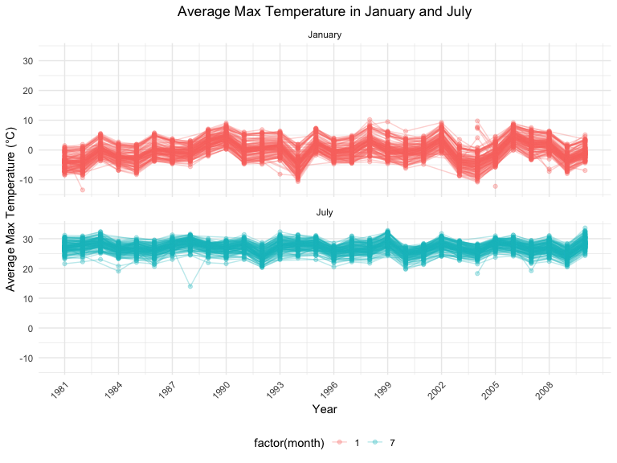
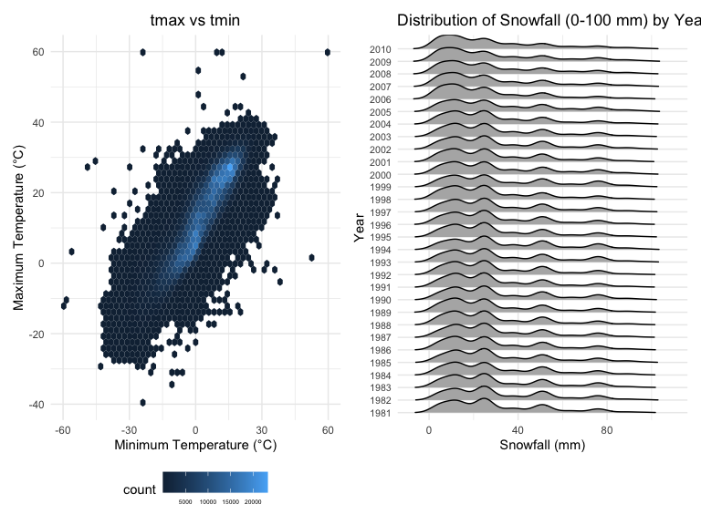
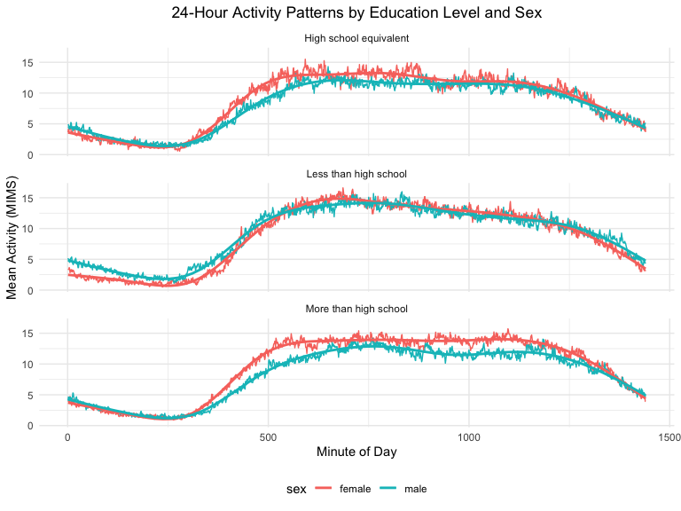

Homework3
================
Yunjia Liu
2024-10-14

## Problem1

Load the dataset.

``` r
data("ny_noaa")
```

Answer to the questions.

1.  Data Cleaning and Exploring the Snowfall Data First, we separate
    variables for year, month, and day in the dataset. Besides, noticing
    the tmax and tmin are chr in the table, we will convert the
    temperature into the numeric. Also, according to the description of
    the dataset, temperature and precipitation are in tenths of degrees
    C and mm separately. So, we also need to convert the unit for these
    two variables. The unit of snowfall is already in mm.

``` r
ny_noaa_clean = ny_noaa |>
  separate(date, c('year', 'month', 'day'), sep = "-",remove = FALSE) |>
  mutate(tmax = as.numeric(tmax),
         tmin = as.numeric(tmin),
         tmax = tmax / 10,
         tmin = tmin / 10,
         prcp = prcp / 10,
         month = as.numeric(month),
         year = as.numeric(year))
```

Second, explore the snowfall data. The most common snowfall value is 0
mm, which suggests many observations recorded no snowfall. This could
also indicate periods of no snow or that snowfall isn’t always measured
consistently. The second common value is NA, which suggests the
measurement of snowfall is missing. The third and fourth common is 25
and 13 mm.

``` r
# Snowfall summary
snowfall_counts = ny_noaa_clean |>
  count(snow) |>
  arrange(desc(n))

print(head(snowfall_counts, 10))
```

    ## # A tibble: 10 × 2
    ##     snow       n
    ##    <int>   <int>
    ##  1     0 2008508
    ##  2    NA  381221
    ##  3    25   31022
    ##  4    13   23095
    ##  5    51   18274
    ##  6    76   10173
    ##  7     8    9962
    ##  8     5    9748
    ##  9    38    9197
    ## 10     3    8790

2.  Two-Panel Plot: Average Max Temperature in January and July. We
    first calculate the average max temperature by grouping the date and
    filtering the months from 12 months to Jan and July.

The plot shows the average maximum temperature in January and July
across several weather stations in New York, with trends for each
station shown across the years. These months represent two extreme
seasons: Winter (cold) and Summer (hot). Temperatures in Jan is be much
lower compared to July. All stations in NY seems to have similar
temperature pattern in Jan/July in one specific year. There are some
individual points(outliners) in the both panel that show unusual
temperatures, which might indicate data entry errors or unusual weather
patterns.

``` r
temp_summary = ny_noaa_clean |>
  group_by(id, year, month) |>
  filter(month %in% c(1, 7)) |>
  summarize(mean_tmax = mean(tmax, na.rm = TRUE))
```

    ## `summarise()` has grouped output by 'id', 'year'. You can override using the
    ## `.groups` argument.

``` r
temp_summary |>
  ggplot(aes(x = year, y = mean_tmax, group = id, color = factor(month))) +
  geom_line(alpha = 0.3) +
  geom_point(alpha = 0.3) +
  facet_wrap(~month, ncol = 1,labeller = labeller(month = c(`1` = "January", `7` = "July"))) +
  labs(
    title = "Average Max Temperature in January and July",
    x = "Year", y = "Average Max Temperature (°C)"
  ) +
  scale_x_continuous(
    breaks = seq(min(temp_summary$year), max(temp_summary$year), by = 3)
  ) +
  theme_minimal() +
  theme(legend.position = "bottom",
        axis.text.x = element_text(angle = 45, hjust = 1),
        plot.title = element_text(hjust = 0.5))
```



3.  Two-Panel Plot: (i) Hex plot for tmax vs tmin and (ii) ridge plot
    for the distribution of snowfall

From the hex plot, we can find that there is a positive correlation
between tmax and tmin since warmer days tend to have both higher minimum
and maximum temperatures.

From the ridge plot, we will see that in most of all years many stations
had snowfall between 0 and 35 mm. Additionally, it is obvious that
certain stations see about 45 mm of snow and a small group of stations
that sees nearly 80 mm. It is probably caused by miscalcualtion between
unit systems. Also, we can find that there’s lower snowfall each year
from past to now, which may serve as a sign for a global warning.

``` r
tmax_tmin_plot = 
  ny_noaa_clean |>
  ggplot(aes(x = tmin, y = tmax)) +
  geom_hex(bins = 50) +
  labs(
    title = "tmax vs tmin",
    x = "Minimum Temperature (°C)", 
    y = "Maximum Temperature (°C)"
  ) +
  theme_minimal() +
    theme(legend.position = "bottom",
          legend.text = element_text(size=5),
          plot.title = element_text(hjust = 0.5))

snowfall_plot = 
  ny_noaa_clean |>
  filter(snow > 0 & snow < 100, !is.na(snow)) |>
  ggplot(aes(x = snow, y = factor(year))) +
  geom_density_ridges(scale = 1.2, rel_min_height = 0.01) +  
  scale_fill_viridis_c(option = "C") +  
  labs(
    title = "Distribution of Snowfall (0-100 mm) by Year",
    x = "Snowfall (mm)", y = "Year"
  ) +
  theme_minimal() +
  theme(
    legend.position = "none",  
    axis.text.y = element_text(size = 8)  
  )

print(tmax_tmin_plot + snowfall_plot)
```

    ## Picking joint bandwidth of 3.76



## Problem2

1.1 Load the dataset. Skip some rows in the beginning of
nhanes_covar.csv to read the correct data.

``` r
accel_data = read_csv("./data/nhanes_accel.csv") |>
  janitor::clean_names()  
```

    ## Rows: 250 Columns: 1441
    ## ── Column specification ────────────────────────────────────────────────────────
    ## Delimiter: ","
    ## dbl (1441): SEQN, min1, min2, min3, min4, min5, min6, min7, min8, min9, min1...
    ## 
    ## ℹ Use `spec()` to retrieve the full column specification for this data.
    ## ℹ Specify the column types or set `show_col_types = FALSE` to quiet this message.

``` r
demographic_data = read_csv("./data/nhanes_covar.csv",skip = 4) |>
  janitor::clean_names()
```

    ## Rows: 250 Columns: 5
    ## ── Column specification ────────────────────────────────────────────────────────
    ## Delimiter: ","
    ## dbl (5): SEQN, sex, age, BMI, education
    ## 
    ## ℹ Use `spec()` to retrieve the full column specification for this data.
    ## ℹ Specify the column types or set `show_col_types = FALSE` to quiet this message.

1.2 Cleaning the data. We exclude participants under 21 and those with
missing demographic data. Then, encoding sex as factor (originally
double) and re-coding the education level.

``` r
demographic_data_clean =
  demographic_data |>
  filter(age >= 21, !is.na(sex), !is.na(education)) |>
  mutate(
    sex = 
      case_match(
        sex, 
        1 ~ "male", 
        2 ~ "female"),
    education =
      case_match(
        education,
        1 ~ "Less than high school",
        2 ~ "High school equivalent",
        3 ~ "More than high school"
      ),
    sex = as.factor(sex),
    education = as.factor(education)
  )
```

2.  We merge Accelerometer Data and Demographic Data by participants id.
    And then create a table of men and female by education level.
    Finally, we visualize age distributions by sex and education level
    using density plot. The plot has age as x-axis and is divided into
    three categories by education level, colored using different colour
    for male and female.

``` r
merged_data = demographic_data_clean |>
  inner_join(accel_data, by = "seqn")

education_table = merged_data |>
  group_by(education, sex) |>
  summarize(count = n(), .groups = "drop") |>
  pivot_wider(names_from = sex, values_from = count, values_fill = 0)
print(education_table)
```

    ## # A tibble: 3 × 3
    ##   education              female  male
    ##   <fct>                   <int> <int>
    ## 1 High school equivalent     23    36
    ## 2 Less than high school      29    28
    ## 3 More than high school      59    56

``` r
merged_data |>
  ggplot(aes(x = age, fill = sex)) +
  geom_density(alpha = 0.5) +
  facet_wrap(~education, ncol = 2) +
  labs(
    title = "Age Distribution by Sex and Education Level",
    x = "Age", y = "Density"
  ) +
  theme_minimal() +
   theme(legend.position = "bottom",
        plot.title = element_text(hjust = 0.5))
```


3.  Aggregate Total Activity for Each Participant and Plot against Age

Sum MIMS values for each participant to get total activity and then plot
total activity against age, with panels for each education level and
color by sex. This plot shows the relationship between total activity
(measured in MIMS) and age, with data split by sex and education level.
The trend lines (using geom_smooth() with loess smoothing) indicate how
activity changes with age, providing a way to compare activity levels
between males and females within each education level.

Comment:

- Across all education levels, we observe a slight decline in total
  activity with *increasing age*.The loess curves show a subtle downward
  trend for both sexes in most panels, indicating that physical activity
  tends to decrease with age.
- Participants with more than *high school education* exhibit more
  stable activity patterns, suggesting that education may play a role in
  maintaining consistent physical activity over time.
- Participants with lower education levels show greater variability in
  their physical activity patterns, indicating that lifestyle factors
  may contribute to differences in physical activity within this group.
- While there are some small differences in specific education
  categories (e.g., slight male advantage at younger ages), the overall
  patterns for men and women are quite similar.

``` r
total_activity = merged_data |>
  group_by(seqn, age, sex, education) |>
  summarize(total_activity = sum(c(min1,min1440), na.rm = TRUE), .groups = "drop")


total_activity |>
ggplot(aes(x = age, y = total_activity, color = sex)) +
  geom_point(alpha = 0.6) +
  geom_smooth() +
  facet_wrap(~education, ncol = 2) +
  labs(
    title = "Total Activity vs Age by Sex and Education Level",
    x = "Age", y = "Total Activity (MIMS)"
  ) +
  theme_minimal()+
  theme(legend.position = "bottom",
        plot.title = element_text(hjust = 0.5))
```

    ## `geom_smooth()` using method = 'loess' and formula = 'y ~ x'


4.  Create 24-hour monitor activity plot

We first pivot the dataset into a longer version so that we can link the
exact time and mims for each individual.Also, we rename and mutate the
exact time ‘X’ from the original column name ‘minX’, converting it into
a numeric. After reshaping, each row now corresponds to a single
participant’s activity for a given minute of the day. Then, we group and
summarize the data to calculate the average activity (MIMS) for each
minute, split by sex and education level.

Comment on the 24-hour monitor activity plot:

- Across all education levels, participants tend to be most active
  during the daytime and less active at night, reflecting normal
  sleep-wake cycles.
- Participants with higher education show slightly more consistent and
  higher peak activity levels, suggesting a possible link between
  education and more structured or healthier lifestyles.
- While small differences exist, overall the patterns are similar
  between men and women. Any differences are more noticeable among
  participants with less education, where men tend to show slightly
  higher activity during the day.

``` r
merged_data_new = merged_data |>
  pivot_longer(min1:min1440,
               names_to='time',
               values_to='mims',
               names_prefix = 'min') |>
  rename(time_min=time)|>
  mutate(time_min=as.numeric(time_min))

hourly_activity = merged_data_new |>
  group_by(time_min, sex, education) |>
  summarize(mean_mims = mean(mims, na.rm = TRUE), .groups = "drop")

ggplot(hourly_activity, aes(x = time_min, y = mean_mims, color = sex)) +
  geom_line() +
  geom_smooth(se = FALSE) +
  facet_wrap(~education, ncol = 1) +
  labs(
    title = "24-Hour Activity Patterns by Education Level and Sex",
    x = "Minute of Day", y = "Mean Activity (MIMS)"
  ) +
  theme_minimal() +
  theme(legend.position = "bottom",
        plot.title = element_text(hjust = 0.5))  
```

    ## `geom_smooth()` using method = 'gam' and formula = 'y ~ s(x, bs = "cs")'



## Problem 3

3.1 We first load the data first and combine the four datasets with year
and month labeled. Then, we recode the varibale type of some columns.

``` r
jan_2020 = read_csv("./data/citibike/Jan 2020 Citi.csv") |>
  janitor::clean_names() |>
  mutate(year_month = "2020-01")
```

    ## Rows: 12420 Columns: 7
    ## ── Column specification ────────────────────────────────────────────────────────
    ## Delimiter: ","
    ## chr (6): ride_id, rideable_type, weekdays, start_station_name, end_station_n...
    ## dbl (1): duration
    ## 
    ## ℹ Use `spec()` to retrieve the full column specification for this data.
    ## ℹ Specify the column types or set `show_col_types = FALSE` to quiet this message.

``` r
july_2020 = read_csv("./data/citibike/July 2020 Citi.csv")|>
  janitor::clean_names() |>
  mutate(year_month = "2020-07")
```

    ## Rows: 21048 Columns: 7
    ## ── Column specification ────────────────────────────────────────────────────────
    ## Delimiter: ","
    ## chr (6): ride_id, rideable_type, weekdays, start_station_name, end_station_n...
    ## dbl (1): duration
    ## 
    ## ℹ Use `spec()` to retrieve the full column specification for this data.
    ## ℹ Specify the column types or set `show_col_types = FALSE` to quiet this message.

``` r
jan_2024 = read_csv("./data/citibike/Jan 2024 Citi.csv") |>
  janitor::clean_names() |>
  mutate(year_month = "2024-01")
```

    ## Rows: 18861 Columns: 7
    ## ── Column specification ────────────────────────────────────────────────────────
    ## Delimiter: ","
    ## chr (6): ride_id, rideable_type, weekdays, start_station_name, end_station_n...
    ## dbl (1): duration
    ## 
    ## ℹ Use `spec()` to retrieve the full column specification for this data.
    ## ℹ Specify the column types or set `show_col_types = FALSE` to quiet this message.

``` r
july_2024 = read_csv("./data/citibike/July 2024 Citi.csv") |>
  janitor::clean_names() |>
  mutate(year_month = "2024-07")
```

    ## Rows: 47156 Columns: 7
    ## ── Column specification ────────────────────────────────────────────────────────
    ## Delimiter: ","
    ## chr (6): ride_id, rideable_type, weekdays, start_station_name, end_station_n...
    ## dbl (1): duration
    ## 
    ## ℹ Use `spec()` to retrieve the full column specification for this data.
    ## ℹ Specify the column types or set `show_col_types = FALSE` to quiet this message.

``` r
citibike_data = 
  bind_rows(jan_2020, july_2020, jan_2024, july_2024) |>
  separate(year_month, into = c('year','month'), sep = '-') |>
  mutate(
    year = as.numeric(year),
    month = as.numeric(month),
    month = 
      case_match(
        month, 
        1 ~ "Jan", 
        7 ~ "July"),
    rideable_type = factor(rideable_type),
    member_casual = factor(member_casual)
  ) 
```

3.2 Create a table of total rides by year, month, and membership type.

The table provides counts of Citi Bike rides grouped by year, month, and
membership type (casual vs. member). Here is the comment on the table:

- Rides peak in July (summer) and drop in January (winter).
- Members consistently take more rides than casual users.
- Both member and casual usage increased significantly between 2020 and
  2024.
- Casual usage grows more in July, reflecting increased tourism and
  outdoor activities in summer.

This analysis highlights the importance of seasonality and membership
programs in Citi Bike’s operations and suggests that service
improvements have driven growth in ridership over the years.

``` r
rides_table = 
  citibike_data |>
  group_by(year, month, member_casual) |>
  summarize(total_rides = n(), .groups = "drop") |>
  pivot_wider(names_from = member_casual, values_from = total_rides, values_fill = 0)

print(rides_table)
```

    ## # A tibble: 4 × 4
    ##    year month casual member
    ##   <dbl> <chr>  <int>  <int>
    ## 1  2020 Jan      984  11436
    ## 2  2020 July    5637  15411
    ## 3  2024 Jan     2108  16753
    ## 4  2024 July   10894  36262

3.3 Filter data for July 2024 and count rides by starting station.

This table shows the five most popular starting stations in the Citi
Bike system for July 2024, along with the total number of rides
originating from each station.

``` r
top_stations = citibike_data |>
  filter(year == 2024, month == "July") |>
  group_by(start_station_name) |>
  summarize(total_rides = n(), .groups = "drop") |>
  arrange(desc(total_rides)) |>
  slice_head(n = 5)

print(top_stations)
```

    ## # A tibble: 5 × 2
    ##   start_station_name       total_rides
    ##   <chr>                          <int>
    ## 1 Pier 61 at Chelsea Piers         163
    ## 2 University Pl & E 14 St          155
    ## 3 W 21 St & 6 Ave                  152
    ## 4 West St & Chambers St            150
    ## 5 W 31 St & 7 Ave                  146

3.4 Plot the Effect of Day, Month, and Year on Median Ride Duration.

We calculate median ride duration by day of week, month, and year. This
plot shows how median ride duration (in minutes) varies by day of the
week, with separate panels for January and July. The color scale at the
bottom reflects different years (from 2020 to 2024). Here’s the comment
on the plot:

``` r
ride_duration_stats = citibike_data |>
  group_by(year, month, weekdays) |>
  summarize(median_duration = median(duration, na.rm = TRUE), .groups = "drop")

ggplot(ride_duration_stats, aes(x = weekdays, y = median_duration, color = year)) +
  geom_point() +
  geom_line(aes(group = interaction(year, month))) +
  facet_wrap(~month, ncol = 2) +
  labs(
    title = "Effect of Day, Month, and Year on Median Ride Duration",
    x = "Day of the Week", y = "Median Ride Duration (Minutes)"
  ) +
  theme_minimal() +
  theme(legend.position = "bottom",
        plot.title = element_text(hjust = 0.5),
        axis.text.x = element_text(angle = 45, hjust = 1))
```


3.5 Investigate the Impact of Month, Membership, and Bike Type on Ride
Duration in 2024. Filter data for 2024 and create a plot of ride
duration distributions

``` r
# Filter data for 2024 and create a plot of ride duration distributions
ggplot(citibike_data %>% filter(year == 2024), 
       aes(x = duration, fill = member_casual)) +
  geom_histogram(bins = 50, position = "identity", alpha = 0.6) +
  facet_grid(rideable_type ~ month) +
  labs(
    title = "Distribution of Ride Duration by Month, Membership, and Bike Type (2024)",
    x = "Ride Duration (Minutes)", y = "Count"
  ) +
  theme_minimal() +
  theme(legend.position = "bottom",
        plot.title = element_text(hjust = 0.5))
```


